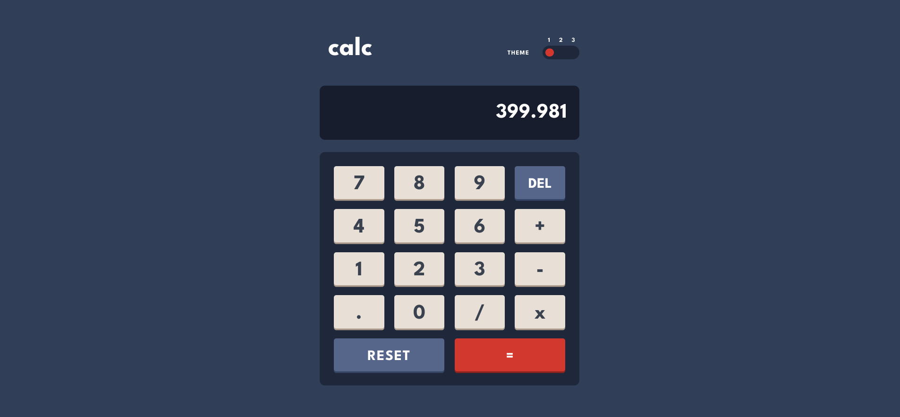

<h1 align="center">Calculator App</h1>

  <h3>
    <a href="maciejnarejko.github.io/calculator-app/">
      Live
    </a>
    | 
    <a href="https://www.frontendmentor.io/solutions/react-calculator-app-keyboard-control-styled-components-and-testing-OMVcjLpUtm">
      Solution
    </a>
    | 
    <a href="https://www.frontendmentor.io/challenges/calculator-app-9lteq5N29">
      Challenge
    </a>
  </h3>

</img>

## About the Project

The challenge is to build out calculator app and get it looking as close to the design as possible. For this purpose you can use any tools you like to help you complete the challenge.

Project assumptions:

- Mathematical operations handling like addition, subtraction, multiplication and division,
- Adjust size of the elements to screen size,
- Select color theme based on user preferences,
- Check for the user's initial theme preference in local storage;

Additional assumptions:

- Implementing keyboard shortcuts for improved application control,
- Conducting mathematical operation validation,
- Implementing hover and click button effects.

This is a solution to the [Calculator App on Frontend Mentor](https://www.frontendmentor.io/challenges/calculator-app-9lteq5N29).

## Built with

- Semantic HTML5 markup
- CSS custom properties
- Grid/Flex
- React
- JavaScript
- Styled components
- Mobile-first workflow

## Local Setup

1. Download or clone the repository.
2. Navigate to the project directory in your terminal.
3. Run `npm install` to install all dependencies.
4. Run `npm start` to start the development server.
5. Open a browser and navigate to `http://localhost:3000` to view the app.

## Running Tests

To run the tests, you can use the command `npm test`. This will start the test runner and run all tests in the project. You can also use the command `npm test [path-to-test-file]` to run a specific test file.

## Author

- Frontend Mentor - <a href="https://www.frontendmentor.io/profile/MaciejNarejko">@MaciejNarejko</a>

## Acknowledgments

Thanks to the FrontendMentor.io community for a code review.
Together we create better code.
